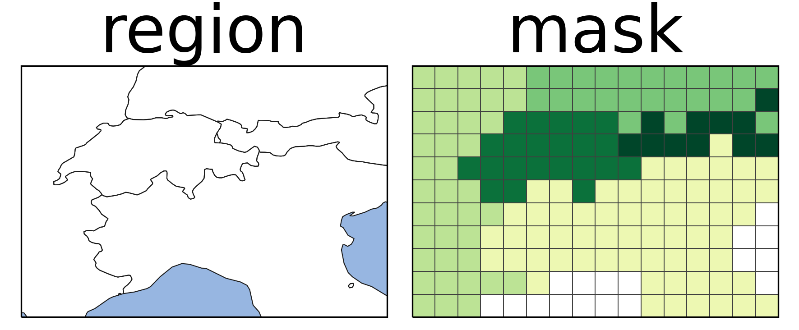

# create *masks* of geospatial *regions* for arbitrary grids

When working with gridded data such as climate model output or reanalysis data it is
often important to create regional averages, e.g., over countries, continents or
regions defined in the literature. To do so we need to know for each grid point to which
region it belongs to.

**regionmask** is a python package that:

- can be used to create *masks* of (geo)spatial *regions* for arbitrary (longitude and latitude) grids. These masks indicate which region a gridpoint belongs to and can then be used to aggregate gridded data over the regions. The masks come in three variants:
  - 2D integer masks
  - 3D boolean masks
  - 3D approximate fractional masks
- takes great care to create consistent masks for
  - region edges and interiors
  - overlapping regions
- contains a number of defined regions, including:
  - countries
  - landmasks
  - regions used in the scientific literature
- can plot figures of these regions
- supports using arbitrary existing or user-defined region definitions:
  - regions defined as shapefiles can be accessed via geopandas
  - user-defined regions can be created via numpy or shapely

## Documentation

Learn more about regionmask in its official documentation at https://regionmask.readthedocs.io

## Get in touch

Don't hesitate to ask usage questions, report bugs, suggest features or view the source
code on GitHub under [regionmask/regionmask](https://github.com/regionmask/regionmask).

## License

regionmask is published under a MIT license.
