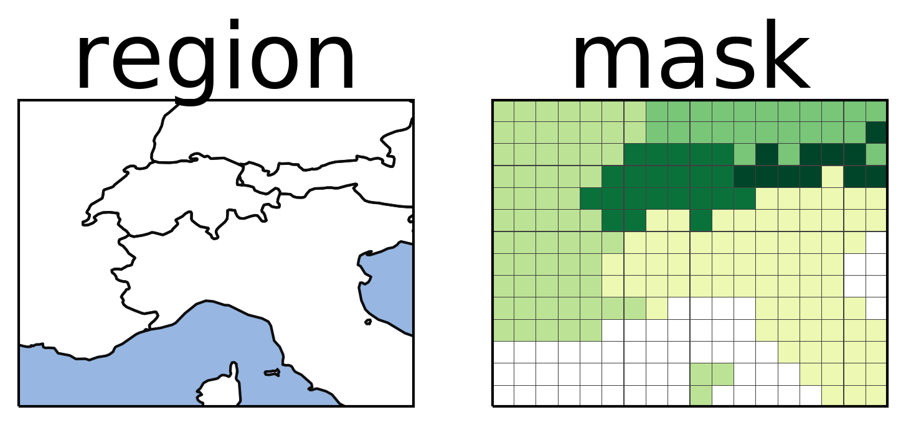

|

=================================================
plotting and creation of masks of spatial regions
=================================================

.. image:: https://travis-ci.org/mathause/regionmask.svg?style=flat
        :target: https://travis-ci.org/mathause/regionmask

Documentation
-------------
See the `documentation <http://regionmask.readthedocs.io/>`_  (on readthedocs).

version : 0.1.0
