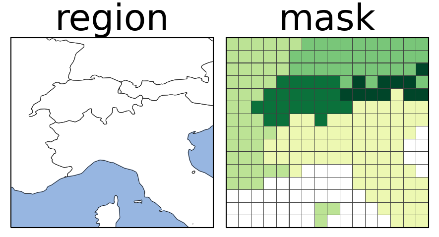

.. regionmask documentation file, created by
   sphinx-quickstart on Wed Jul 20 14:36:54 2016.
   You can adapt this file completely to your liking, but it should at least
   contain the root `toctree` directive.

|

************************************
create masks of geographical regions
************************************

Determine which geographic region each grid point belongs to.

When working with gridded data such as climate model output or reanalysis data it is
often important to create regional averages, e.g., over countries, continents or
regions defined in the literature. To do so we need to know for each grid point to which
region it belongs to.

regionmask is a python package that:

- can be used to create *masks* of geographic *regions* for arbitrary longitude and latitude grids.
  These masks indicate which region a gridpoint belongs to. They come in two variants:

  - :doc:`2D integer masks<notebooks/mask_2D>`
  - :doc:`3D boolean masks<notebooks/mask_3D>`

- takes great care to consistently treat gridpoints and overlapping regions, see

  - :doc:`Edge behavior and interiors<notebooks/method>`
  - :doc:`Overlapping regions<notebooks/overlap>`

- contains a number of defined regions, including:

  - :doc:`countries</defined_countries>`
  - :doc:`landmasks</defined_landmask>`
  - :doc:`regions used in the scientific literature</defined_scientific>`

- can :doc:`plot figures of these regions<notebooks/plotting>`

- supports using arbitrary existing or user-defined region definitions:

  - regions defined as shapefiles can be :doc:`accessed via geopandas<notebooks/geopandas>`
  - :doc:`user-defined regions<notebooks/create_own_regions>` can be created via numpy or shapely

Documentation
=============

.. toctree::
   :maxdepth: 2
   :hidden:
   :caption: Getting Started

   installation

.. toctree::
   :maxdepth: 2
   :hidden:
   :caption: Methods

   notebooks/method

.. toctree::
   :maxdepth: 2
   :hidden:
   :caption: Usage: Tutorials

   notebooks/plotting
   notebooks/mask_2D
   notebooks/mask_3D
   notebooks/detect_coords
   notebooks/geopandas
   notebooks/create_own_regions
   notebooks/overlap
   intake_regionmask

.. toctree::
   :maxdepth: 2
   :hidden:
   :caption: Defined Regions

   defined_countries
   defined_landmask
   defined_ocean_basins
   defined_scientific

.. toctree::
   :maxdepth: 2
   :hidden:
   :caption: API Reference

   changelog
   api

License
=======

regionmask is published under a MIT license.

Indices and tables
==================

* :ref:`genindex`
* :ref:`search`
