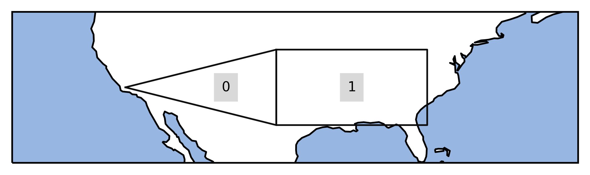
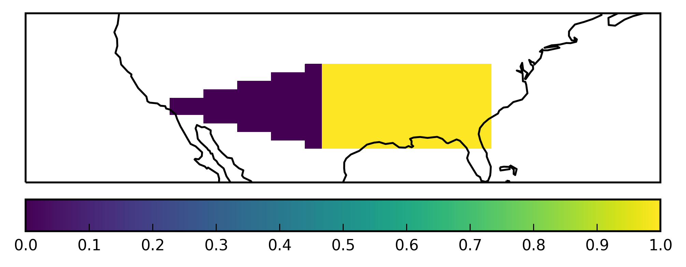

.. module:: regionmask

.. note:: This tutorial was generated from an IPython notebook that can be
          downloaded `here <../../_static/notebooks/create_own_regions.ipynb>`_.

.. _create_own_regions:

Create your own region
======================

Creating own regions is straightforward.

Import regionmask and check the version:

.. code:: python

    import regionmask
    regionmask.__version__

.. parsed-literal::

    '0.9.0'

Assume you have two custom regions in the US.

.. code:: python

    US1 = [[-100., 30], [-100, 40], [-120, 35]]
    US2 = [[-100., 30], [-80, 30], [-80, 40], [-100, 40]]

You also need to provide numbers, names and abbreviations:

.. code:: python

    numbers = [0, 1]
    names = ['US_west', 'US_east']
    abbrevs = ['USw', 'USe']
    
    USmask = regionmask.Regions_cls('USmask', numbers, names, abbrevs, [US1, US2])

Again we can plot the outline of the defined regions

.. code:: python

    ax = USmask.plot() #(label='abbrev')
    
    # load cartopy
    import cartopy.crs as ccrs
    # fine tune the extent
    ax.set_extent([225, 300, 25, 45], crs=ccrs.PlateCarree());

and obtain a mask:

.. code:: python

    import numpy as np
    
    # define lat/ lon grid
    lon = np.arange(200.5, 330)
    lat = np.arange(74.5, 15, -1)
    
    # for the plotting
    lon_edges = np.arange(200, 330)
    lat_edges = np.arange(74, 14, -1)
    
    mask = USmask.mask(lon, lat, wrap_lon=True)

.. code:: python

    import matplotlib.pyplot as plt
    
    ax = plt.subplot(111, projection=ccrs.PlateCarree())
    # pcolormesh does not handle NaNs, requires masked array
    mask_ma = np.ma.masked_invalid(mask)
    
    h = ax.pcolormesh(lon_edges, lat_edges, mask_ma, transform=ccrs.PlateCarree(), cmap='viridis')
    
    ax.coastlines()
    
    plt.colorbar(h, orientation='horizontal', pad=0.04);
    
    ax.set_extent([225, 300, 25, 45], crs=ccrs.PlateCarree());

Use shapely Polygon
-------------------

If you have the region defined as a shapely polygon, this also works:

.. code:: python

    from shapely.geometry import Polygon
    
    US1_poly = Polygon(US1)
    US2_poly = Polygon(US2)

.. code:: python

    USmask_poly = regionmask.Regions_cls('USmask', numbers, names, abbrevs, [US1_poly, US2_poly])
