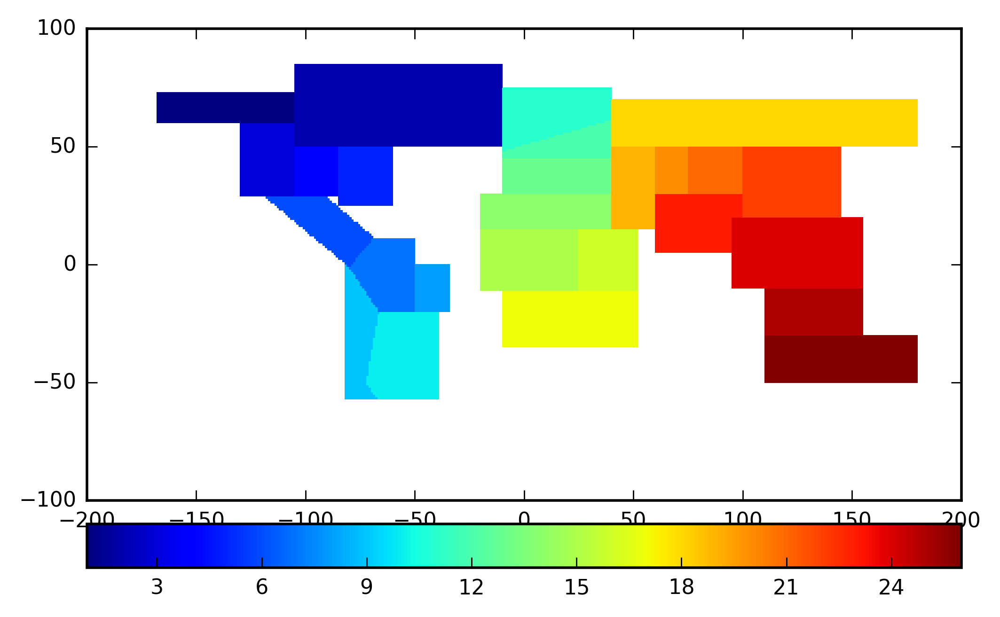
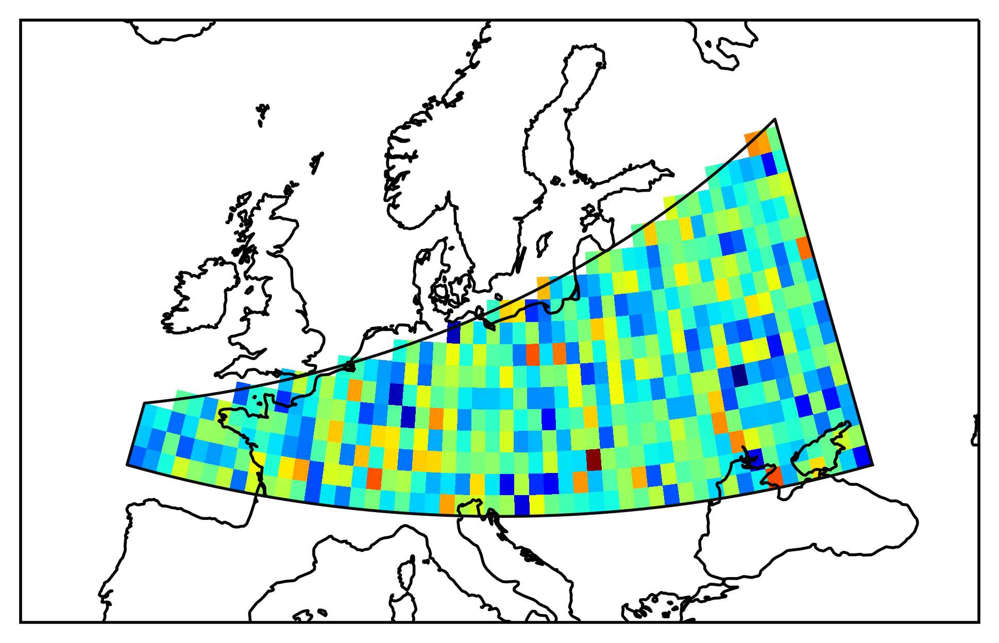
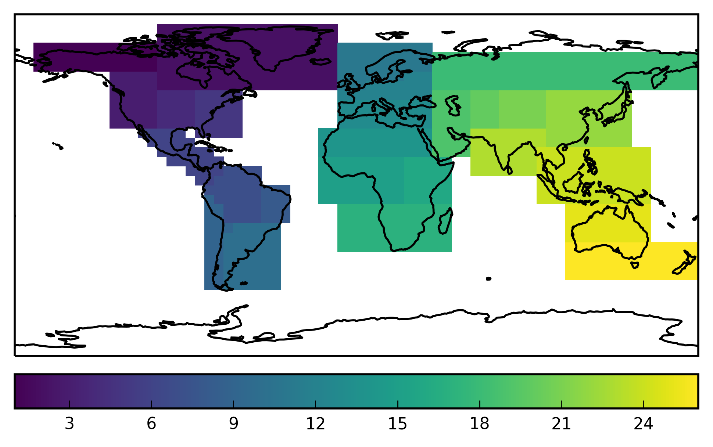

.. module:: regionmask

.. note:: This tutorial was generated from an IPython notebook that can be
          downloaded `here <../../_static/notebooks/mask_numpy.ipynb>`_.

.. _mask_numpy:

Create numpy region mask
========================

In this tutorial we will show how to create a mask for arbitrary
latitude and longitude grids.

Import regionmask and check the version:

.. code:: python

    import regionmask
    regionmask.__version__

.. parsed-literal::

    '0.9.0'

We define a lon/ lat grid with a 1° grid spacing, where the points
define the middle of the grid. Additionally we create a grid that spans
the edges of the grid for the plotting.

.. code:: python

    # define a longitude latitude grid
    lon = np.arange(-179.5, 180)
    lat = np.arange(-89.5, 90)
    
    # for the plotting
    lon_edges = np.arange(-180, 181)
    lat_edges = np.arange(-90, 91)

Again we use the SREX regions. Using ``xarray=False`` tells the code to
output to a numpy array.

.. code:: python

    mask = regionmask.srex.mask(lon, lat, xarray=False)

``mask`` is now a ``n_lon x n_lat`` numpy array. Gridpoints that do not
fall in a region are NaN, the gridpoints that fall in a region are
encoded with the number of the region (here 1 to 26).

The function ``mask`` determines if all cominations of points given in
``lon`` and ``lat`` lies within the polygon making up the region.

We can now plot the ``mask``:

.. code:: python

    import cartopy.crs as ccrs
    import matplotlib.pyplot as plt
    
    ax = plt.subplot(111, projection=ccrs.PlateCarree())
    # pcolormesh does not handle NaNs, requires masked array
    mask_ma = np.ma.masked_invalid(mask)
    
    h = ax.pcolormesh(lon_edges, lat_edges, mask_ma, transform=ccrs.PlateCarree(), cmap='viridis')
    
    ax.coastlines()
    
    plt.colorbar(h, orientation='horizontal', pad=0.04);

Finally the ``mask`` can now be used to mask out all data that is not in
a specific region.

.. code:: python

    # create random data
    data = np.random.randn(*lat.shape + lon.shape)
    
    # only retain data in the Central Europe
    data_ceu = np.ma.masked_where(mask != 12, data)

Plot the selected data

.. code:: python

    # load cartopy
    import cartopy.crs as ccrs
    
    # choose a good projection for regional maps
    proj=ccrs.LambertConformal(central_longitude=15)
    
    # plot the outline of the central European region
    ax = regionmask.srex.plot(regions=12, add_ocean=False, resolution='50m',
                              proj=proj, add_label=False)
    
    ax.pcolormesh(lon_edges, lat_edges, data_ceu, transform=ccrs.PlateCarree())
    
    # fine tune the extent
    ax.set_extent([-15, 45, 40, 65], crs=ccrs.PlateCarree())

Finally we can obtain the region mean:

.. code:: python

    print('Global mean:   ', np.mean(data))
    print('Central Europe:', np.mean(data_ceu))

.. parsed-literal::

    Global mean:    0.00508462928478
    Central Europe: 0.033885820489

Create a mask with a different lon/ lat grid
--------------------------------------------

The interesting thing of ``gridmask`` is that you can use any lon/ lat
grid.

Use a 5° x 5° grid:

.. code:: python

    # define a longitude latitude grid
    lon5 = np.arange(-177.5, 180, 5)
    lat5 = np.arange(-87.5, 90, 5)
    
    # for the plotting
    lon5_edges = np.arange(-180, 181, 5)
    lat5_edges = np.arange(-90, 91, 5)
    
    mask5_deg = regionmask.srex.mask(lon5, lat5, xarray=False)

.. code:: python

    ax = plt.subplot(111, projection=ccrs.PlateCarree())
    # pcolormesh does not handle NaNs, requires masked array
    mask5_ma = np.ma.masked_invalid(mask5_deg)
    
    h = ax.pcolormesh(lon5_edges, lat5_edges, mask5_ma, transform=ccrs.PlateCarree(), cmap='viridis')
    
    ax.coastlines()
    
    plt.colorbar(h, orientation='horizontal', pad=0.04);

Now the grid cells are much larger.
