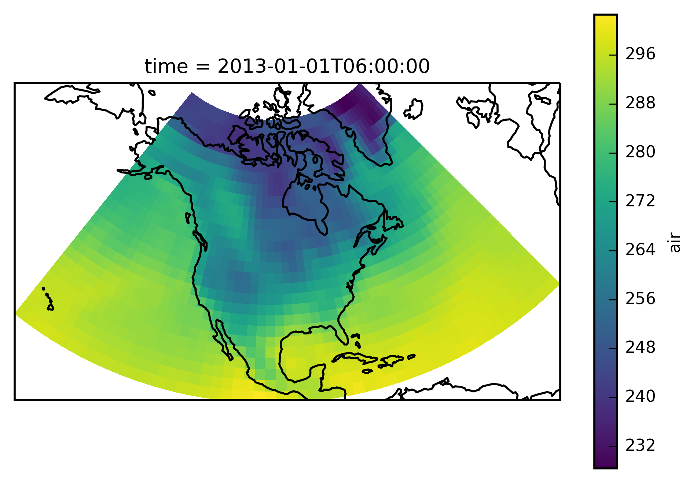
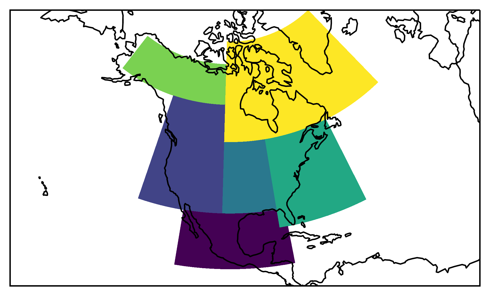
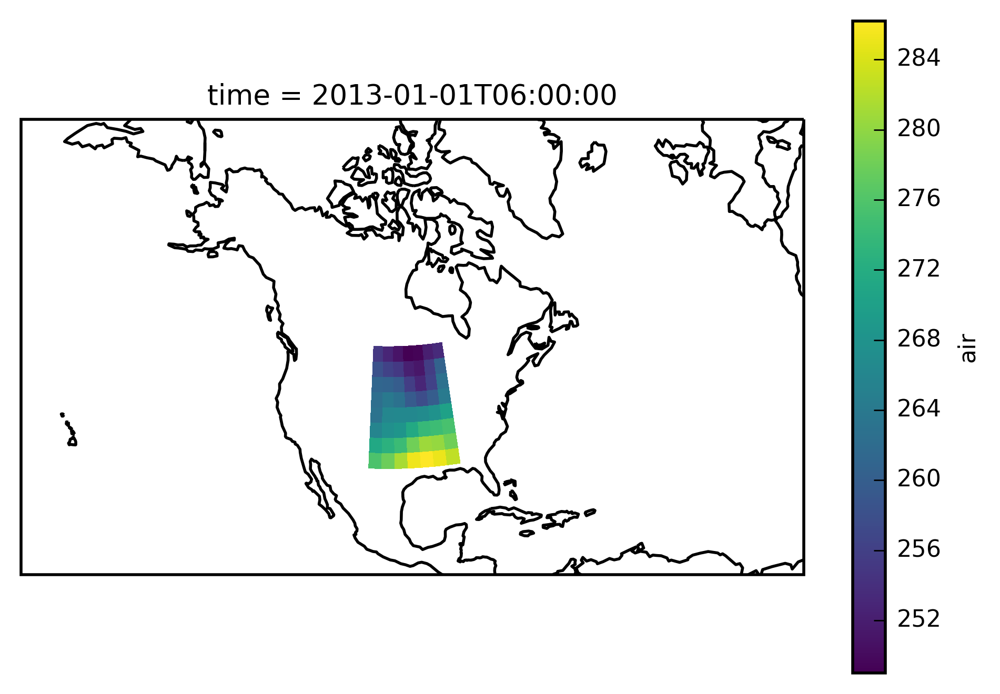
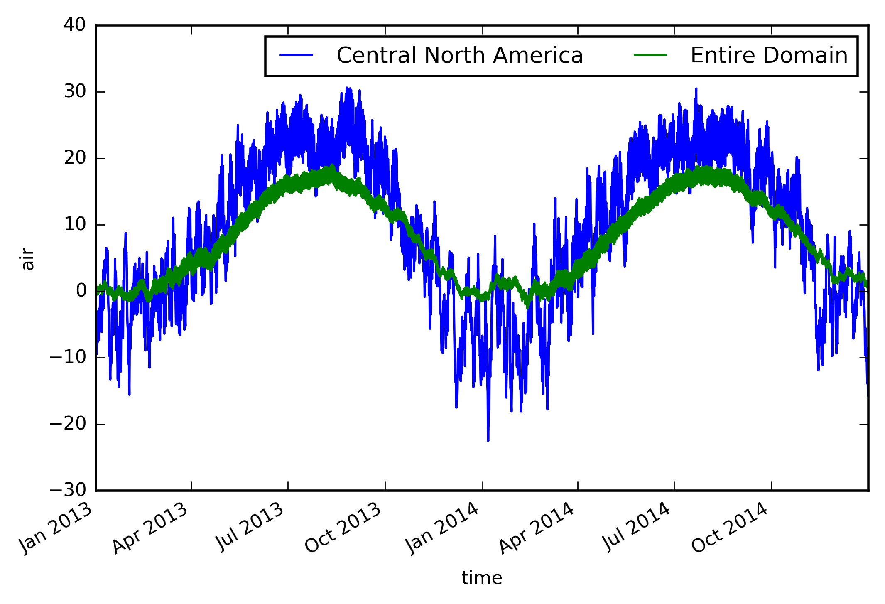

.. module:: regionmask

.. note:: This tutorial was generated from an IPython notebook that can be
          downloaded `here <../../_static/notebooks/mask_xarray.ipynb>`_.

.. _mask_xarray:

Create xarray region mask
=========================

In this tutorial we will show how to create a mask for arbitrary
latitude and longitude grids using xarray. It is very similar to the
tutorial Create Mask (numpy).

Import regionmask and check the version:

.. code:: python

    import regionmask
    regionmask.__version__

.. parsed-literal::

    '0.9.0'

Load xarray and the tutorial data:

.. code:: python

    import xarray as xr
    import numpy as np

.. code:: python

    airtemps = xr.tutorial.load_dataset('air_temperature')

The example data is a temperature field over North America. Let's plot
the first time step:

.. code:: python

    # load cartopy
    import cartopy.crs as ccrs
    
    # choose a good projection for regional maps
    proj=ccrs.LambertConformal(central_longitude=-100)
    
    ax = plt.subplot(111, projection=proj)
    
    airtemps.isel(time=1).air.plot.geocolormesh(ax=ax, transform=ccrs.PlateCarree())
    
    ax.coastlines();

.. parsed-literal::

    /home/mathause/.local/lib/python2.7/site-packages/matplotlib/artist.py:221: MatplotlibDeprecationWarning: This has been deprecated in mpl 1.5, please use the
    axes property.  A removal date has not been set.
      warnings.warn(_get_axes_msg, mplDeprecation, stacklevel=1)

Conviniently we can directly pass an xarray object to the ``mask``
function. It gets the longitude and latitude from the DataArray/ Dataset
and creates the ``mask``. If the longituda and latitude in the xarray
object are not called ``lon`` and ``lat``, respectively; their name can
be given via the ``lon_name`` and ``lat_name`` keyword. Here we use the
Giorgi regions.

.. code:: python

    mask = regionmask.giorgi.mask(airtemps)
    print('All NaN? ',np.all(np.isnan(mask)))

.. parsed-literal::

    All elements of mask are NaN. Try to set 'wrap_lon=True'.
    All NaN?  True

This didn't work - all elements are NaNs! The reason is that airtemps
has its longitude from 0 to 360 while the Giorgi regions are defined as
-180 to 180. Thus we can provide the ``wrap_lon`` keyword:

.. code:: python

    mask = regionmask.giorgi.mask(airtemps, wrap_lon=True)
    print('All NaN? ',np.all(np.isnan(mask)))

.. parsed-literal::

    All NaN?  False

This is better. Let's plot the regions:

.. code:: python

    proj=ccrs.LambertConformal(central_longitude=-100)
    ax = plt.subplot(111, projection=proj)
    
    low = mask.min()
    high = mask.max()
    
    levels = np.arange(low - 0.5, high + 1)
    
    mask.plot.pcolormesh(ax=ax, transform=ccrs.PlateCarree(), levels=levels, add_colorbar=False)
    
    ax.coastlines()
    
    # fine tune the extent
    ax.set_extent([200, 330, 10, 75], crs=ccrs.PlateCarree());

We want to select the region 'Central North America'. Thus we first need
to find out which number this is:

.. code:: python

    regionmask.giorgi.map_keys('Central North America')

.. parsed-literal::

    6

``xarray`` provides the handy ``where`` function:

.. code:: python

    airtemps_CNA = airtemps.where(mask == 6)

Check everything went well by repeating the first plot with the selected
region:

.. code:: python

    # choose a good projection for regional maps
    proj=ccrs.LambertConformal(central_longitude=-100)
    
    ax = plt.subplot(111, projection=proj)
    
    airtemps_CNA.isel(time=1).air.plot.geocolormesh(ax=ax, transform=ccrs.PlateCarree())
    
    ax.coastlines();

Looks good - let's take the area average and plot the time series.
(Note: you should use ``cos(lat)`` weights to correctly calculate an
area average. Unfortunately this is not yet (as of version 0.7)
implemented in xarray.)

.. code:: python

    ts_airtemps_CNA = airtemps_CNA.mean(dim=('lat', 'lon')) - 273.15
    ts_airtemps = airtemps.mean(dim=('lat', 'lon')) - 273.15
    
    # and the line plot
    ts_airtemps_CNA.air.plot.line(label='Central North America')
    ts_airtemps.air.plot(label='Entire Domain')
    
    plt.legend(ncol=2)

.. parsed-literal::

    <matplotlib.legend.Legend at 0x2adada801dd0>

