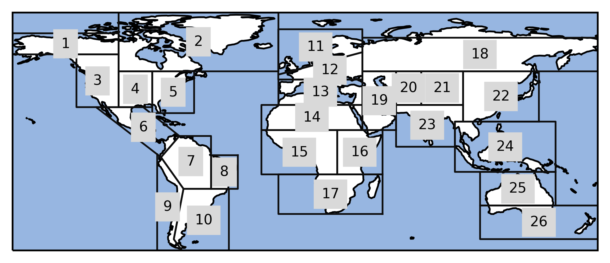
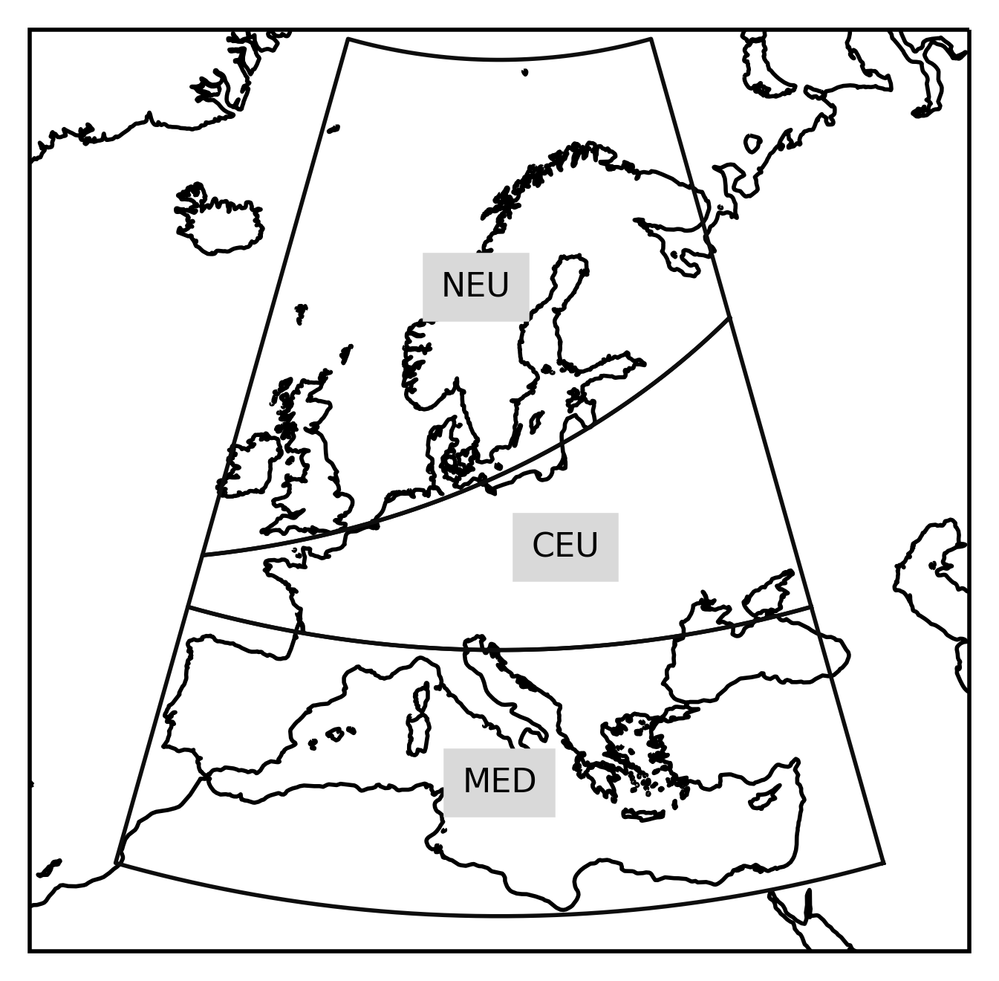

.. module:: regionmask

.. note:: This tutorial was generated from an IPython notebook that can be
          downloaded `here <../../_static/notebooks/plotting.ipynb>`_.

.. _plotting:

Plotting
========

Every region has a plotting function, that draws the outline of all (or
selected) regions on a cartopy map. We use the predefined SREX regions
as example.

Import regionmask and check the version:

.. code:: python

    import regionmask
    regionmask.__version__

.. parsed-literal::

    '0.9.0'

Plot all regions
----------------

Do the default plot.

.. code:: python

    regionmask.srex.plot()

.. parsed-literal::

    <cartopy.mpl.geoaxes.GeoAxesSubplot at 0x2b6e4f85c790>

Plot only a Subset of Regions
-----------------------------

.. code:: python

    # load cartopy
    import cartopy.crs as ccrs
    
    # regions can be selected by number, abbreviation or long name
    regions=[11, 'CEU', 'S. Europe/Mediterranean']
    
    # choose a good projection for regional maps
    proj=ccrs.LambertConformal(central_longitude=15)
    
    # do the plot
    ax = regionmask.srex.plot(regions=regions, add_ocean=False, resolution='50m',
                              proj=proj, label='abbrev')
    
    # fine tune the extent
    ax.set_extent([-15, 45, 28, 75], crs=ccrs.PlateCarree())

